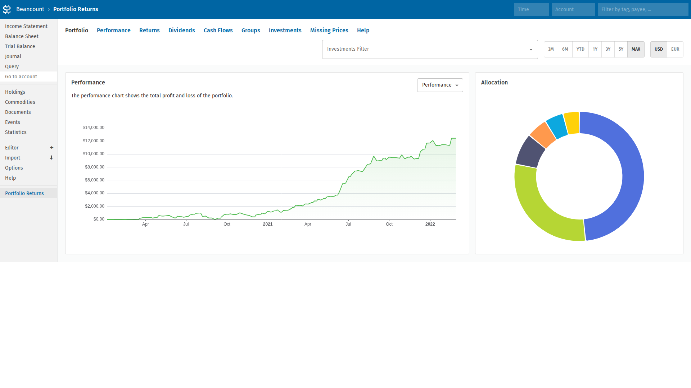
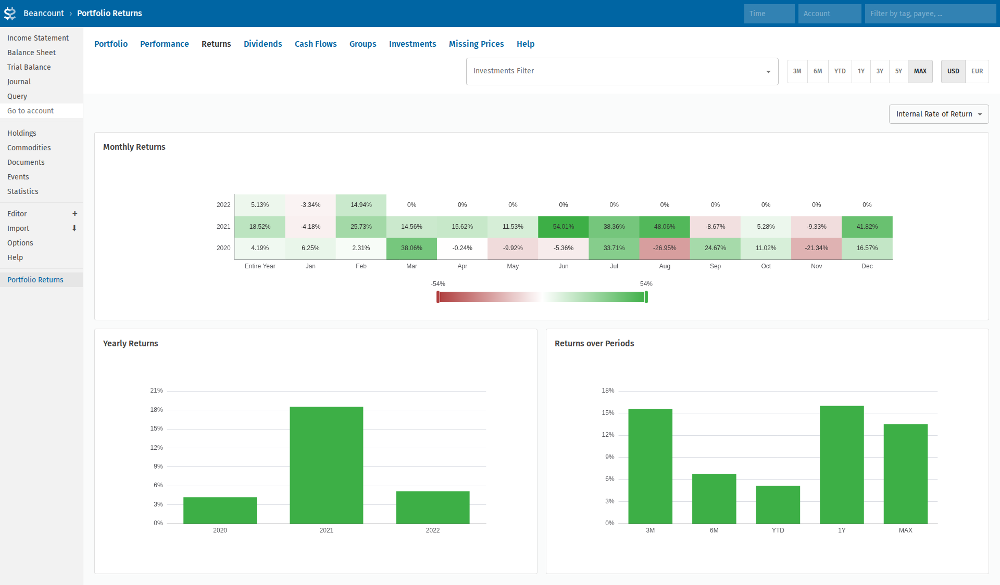
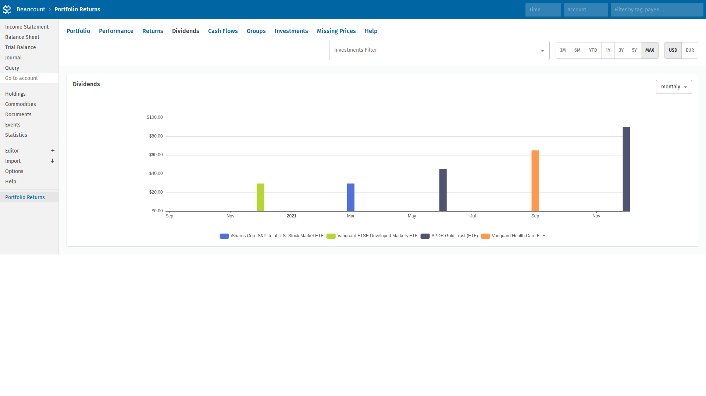
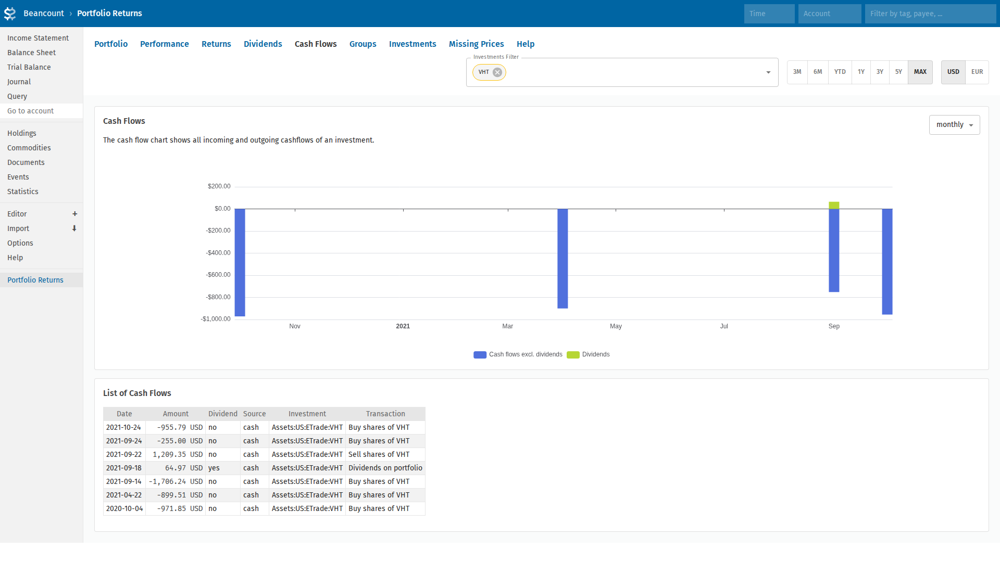
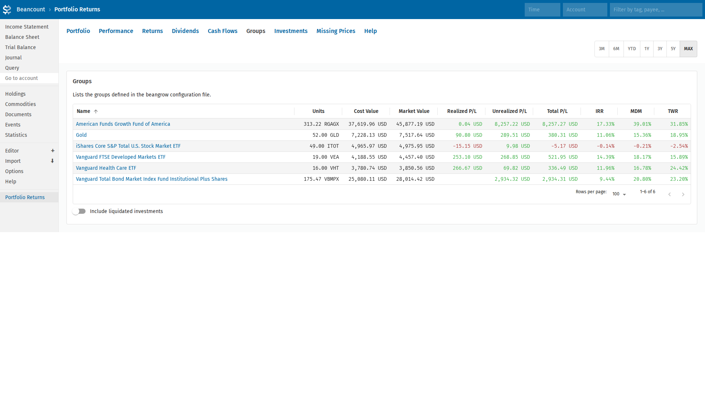

# Fava Portfolio Returns
[](https://github.com/andreasgerstmayr/fava-portfolio-returns/actions/workflows/continuous-integration.yaml)

fava-portfolio-returns shows portfolio returns in the [Fava](https://github.com/beancount/fava) web interface. It leverages [beangrow](https://github.com/beancount/beangrow) to categorize transactions and calculate the portfolio returns of a beancount ledger.

[](frontend/tests/e2e/pages.test.ts-snapshots/PNG-Snapshot-Tests-Light-Theme-Portfolio-1-chromium-linux.png)
[](frontend/tests/e2e/pages.test.ts-snapshots/PNG-Snapshot-Tests-Light-Theme-Performance-1-chromium-linux.png)
[](frontend/tests/e2e/pages.test.ts-snapshots/PNG-Snapshot-Tests-Light-Theme-Returns-1-chromium-linux.png)
[](frontend/tests/e2e/pages.test.ts-snapshots/PNG-Snapshot-Tests-Light-Theme-Dividends-1-chromium-linux.png)
[](frontend/tests/e2e/pages.test.ts-snapshots/PNG-Snapshot-Tests-Light-Theme-Cash-Flows-1-chromium-linux.png)
[](frontend/tests/e2e/pages.test.ts-snapshots/PNG-Snapshot-Tests-Light-Theme-Groups-1-chromium-linux.png)

## Installation
```
pip install git+https://github.com/andreasgerstmayr/fava-portfolio-returns.git
```

## Usage
Please setup [beangrow](https://github.com/beancount/beangrow) first, using this guide: https://beancount.github.io/docs/calculating_portolio_returns.html.

Enable this plugin in Fava by adding the following lines to your ledger:
```
2010-01-01 custom "fava-extension" "fava_portfolio_returns" "{
  'beangrow_config': 'beangrow.pbtxt',
}"
```

## View Example Ledger
`cd example; fava example.beancount`

## Building from Source
Run `make build-js` to compile the frontend. The compiled and bundled code will be placed in `src/fava_portfolio_returns/FavaPortfolioReturns.js`.

Run `make dev` to start a development server and automatically rebuild the frontend for any changes.

## Related Projects
* [Fava Portfolio Summary](https://github.com/PhracturedBlue/fava-portfolio-summary)
* [Fava Classy Portfolio](https://github.com/seltzered/fava-classy-portfolio)
* [Fava Investor](https://github.com/redstreet/fava_investor)
* [Fava Dashboards](https://github.com/andreasgerstmayr/fava-dashboards)

## Acknowledgements
Thanks to Martin Blais and all contributors of [beancount](https://github.com/beancount/beancount) and [beangrow](https://github.com/beancount/beangrow),
Jakob Schnitzer, Dominik Aumayr and all contributors of [Fava](https://github.com/beancount/fava),
and to all contributors of [Apache ECharts](https://echarts.apache.org).
